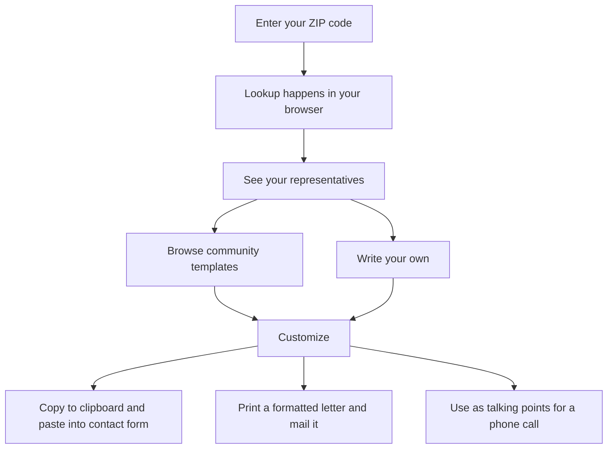

# Democracy Direct

This is the source code for [democracy-direct.com](https://democracy-direct.com).

## Your representatives work for you

Elected officials are public servants. They represent _you_. But actually reaching them shouldn't require navigating five government websites, filling out invasive forms, or wondering if your message went into a void.

Democracy Direct makes it simple: enter your ZIP code, see who represents you, and contact them directly through their official channels. Paste a letter into their contact form, print one to mail, or call their office with talking points in hand.

No account required. No app to download. No data harvested.

## Letter templates and talking points

Not sure what to say? Browse community-contributed templates for common issues: healthcare, education, housing, climate, civil rights, local infrastructure, and more. Find one that fits, customize it to your situation, and send it.

Templates work for any contact method. Use them to draft a letter for the contact form, print a formatted letter to mail via USPS, or pull out the key points for a phone call to your rep's office.

If you write something good, share it. Templates can be forked, adapted, and reused. One well-written letter can become the foundation for thousands of constituent contacts.

Templates are moderated for safety, not viewpoint. Hate speech, threats, and spam are removed. Strong political opinions (left, right, or otherwise) are welcome. Criticism of any politician or policy is permitted.

## Why this code is public

This project is open source because civic tools should be transparent. When a website asks for your information, you deserve to know exactly what happens to it.

The code in this repository is the same code running on democracy-direct.com. Anyone can read it, audit it, or run their own copy. There are no hidden trackers, no secret analytics, no background data collection that isn't visible right here.

### How your privacy is protected

The server provides representative data and templates, but everything else happens on your device. The server never sees your ZIP code, never sees what you write, and never touches your message.

**Your email address is never stored.** Accounts use a one-way cryptographic hash. The original email cannot be recovered, even by someone with full database access. This isn't a policy; it's math.

**Your searches stay in your browser.** When you enter a ZIP code, the lookup happens locally using data that's already loaded on the page. The server never sees what you searched for.

**Your messages never touch the server.** The text you write is copied to your clipboard, printed locally, or used as talking points. Democracy Direct never sees, stores, or transmits what you write.

## Where the data comes from

Representative information comes from public sources maintained by government agencies and civic organizations:

- **Federal legislators:** [unitedstates/congress-legislators](https://github.com/unitedstates/congress-legislators), a public dataset maintained by volunteers
- **Voting records:** [Congress.gov](https://api.congress.gov), the official Congressional database
- **State legislators:** [Open States](https://openstates.org), a nonpartisan nonprofit
- **ZIP code mapping:** [U.S. Census Bureau](https://www.census.gov/programs-surveys/decennial-census/about/rdo/congressional-districts.html)

This data is refreshed regularly. If something looks wrong, [open an issue](https://github.com/yourusername/democracy-direct/issues).

## Who runs this

Democracy Direct is an independent project. It is not affiliated with any political party, campaign, PAC, nonprofit, or government entity.

The project is funded entirely by donations. There are no ads, no sponsors, no "premium" features, and no data sales. Operating costs are minimal by design. The entire platform runs on free or near-free infrastructure.

## What the license means

The code is released under the AGPL-3.0 license. In practical terms: anyone can use, study, modify, and share this code. If someone takes this code, modifies it, and runs it as a public service, they're required to publish their modifications under the same license.

This ensures that Democracy Direct, or anything built from it, remains open and auditable. Civic infrastructure should stay in public hands.

## For developers

Technical documentation, setup instructions, and contribution guidelines are in [CONTRIBUTING.md](CONTRIBUTING.md).

---

Questions or concerns? Reach out at hello@democracy-direct.com
